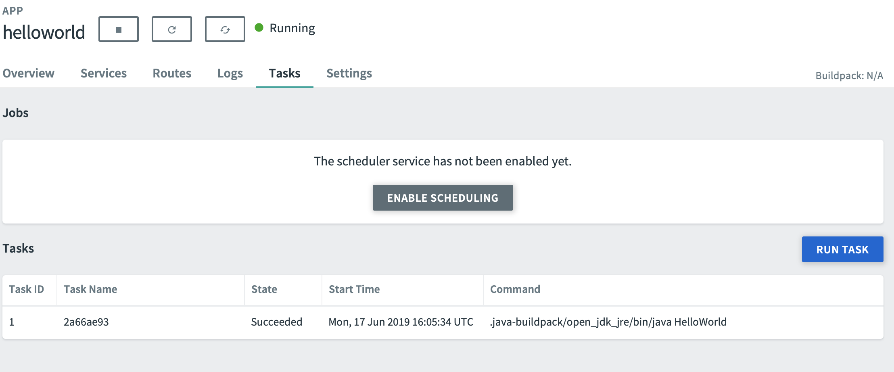
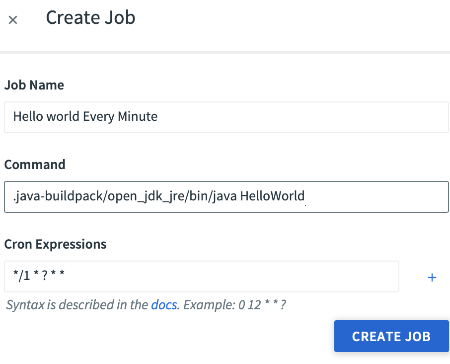

# PCF Task Demo

# Requirements:

A valid PCF instance 
A valid JDK installed
The PCF CLI locally installed

# 1. Create a new project directory

```sh
mkdir pcf-task-demo
cd pcf-task-demo
```

# 2. Create a sample Helloworld Java File in the directory (HellowWorld.java)

```java
public class HelloWorld
{
    public static void main(String[] args)
    {
        System.out.println("Hello world!!");
    }
}
```

# 3. Compile and Test your Hellworld App

To compile:

```sh 
javac HelloWorld.java
```

To run:

```sh
java HelloWorld
```

You should see your Hello World message in the standard output.

# 4. Package and Test your Helloworld Jar File

To packakge:

```sh
jar cfe HelloWorld.jar HelloWorld HelloWorld.class
```

To test:
```sh
java -jar HelloWorld.jar

```

You should see your Hello World message in the standard output.

# 5. Deploy your Jar File to PCF

```sh
cf push helloworld --no-route -i 0  -p HelloWorld.jar
```

Note:  We deploy with no default routes created, and with 0 initial instance running.  

> Discussion Item : long runnings instances vs one-off "jobs , including cost considerations

# 6. Run your Helloworld Task one-off in PCF as a task 

```sh
cf run-task helloworld ".java-buildpack/open_jdk_jre/bin/java HelloWorld"

```

Task should be submitted successfully for execution.

# 7. Inspect PCF Task Status

```sh
cf tasks helloworld
```

> Discussion Item : Viewing task in the PCF GUI

# 8. Inspect the PCF logs for succesful execution 

```sh
cf logs helloworld --recent
```

You should see a log message with your Helloworld messages followed by and Exit Status of 0. 


# 9. Verify that PCF Scheduler is available in the PCF Marketplace

```sh
cf marketplace
```

You should see an item called scheduler-for-pcf. If not , contact your PCF administrator to get this installed. 

# 10. Enable Scheduling in your Helloworld App using the PCF GUI

In Appsman, under the Tasks menu, click *Enable Scheduling*.   



# 11. Create a Job using the PCF GUI

Click on the now available *Create Job* button.

For testing purposes, we will be running our Helloworld Message every minute. 

Job Name: *Helloworld Every Minute*

Command: *.java-buildpack/open_jdk_jre/bin/java HelloWorld*

Cron Expressions: *\*/1 \* ? \* \**



> Discussion Items : manully running the job , jobs vs tasks

